# ModestBench Architectural Overview

## Executive Summary

**ModestBench** is a TypeScript-based benchmarking framework that wraps [tinybench](https://github.com/tinylibs/tinybench) to provide structure, CLI tooling, historical tracking, performance budgets, and multiple output formats for JavaScript/TypeScript performance testing. The architecture follows a dependency injection pattern with clear separation of concerns across subsystems.

**Core Technology**: Node.js 18+, TypeScript, tinybench 2.6.0

**Key Dependencies**:

- `tinybench` - Core benchmarking engine
- `yargs` - CLI argument parsing
- `glob` - File discovery
- `cosmiconfig` - Configuration loading
- `zod` - Schema validation

---

## 1. System Architecture Overview

### 1.1 High-Level Subsystems

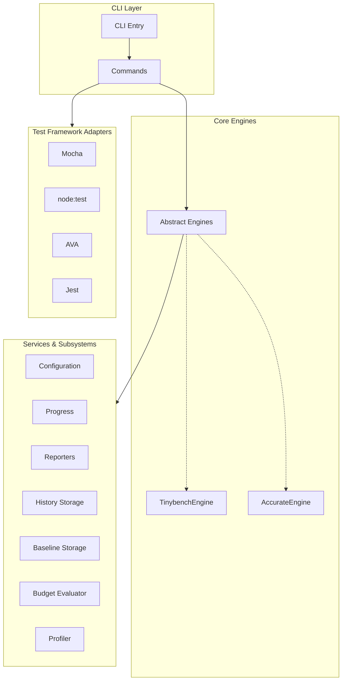

### 1.2 Subsystem Breakdown

| Subsystem      | Purpose                                    | Key Files                                | Stateful?           |
| -------------- | ------------------------------------------ | ---------------------------------------- | ------------------- |
| **CLI**        | Command-line interface and command routing | `cli/index.ts`<br/>`cli/commands/*.ts`   | No                  |
| **Core**       | Benchmark orchestration and execution      | `core/engine.ts`<br/>`core/engines/*.ts` | No                  |
| **Services**   | Business logic and data management         | `services/*.ts`                          | Mixed               |
| **Config**     | Configuration loading and merging          | `services/config-manager.ts`             | No                  |
| **Progress**   | Real-time progress tracking                | `services/progress-manager.ts`           | Yes                 |
| **Reporters**  | Output formatting (human/JSON/CSV/nyan)    | `reporters/*.ts`                         | Yes (HumanReporter) |
| **History**    | Historical benchmark data persistence      | `services/history-storage.ts`            | Yes                 |
| **Baseline**   | Named baseline management                  | `services/baseline-storage.ts`           | Yes                 |
| **Budget**     | Performance budget evaluation              | `services/budget-evaluator.ts`           | No                  |
| **Profiler**   | CPU profiling and analysis                 | `services/profiler/*.ts`                 | No                  |
| **Adapters**   | Test framework integration                 | `adapters/*.ts`                          | No                  |
| **Formatters** | History output formatting                  | `formatters/history/*.ts`                | No                  |
| **Errors**     | Structured error handling                  | `errors/*.ts`                            | No                  |
| **Types**      | TypeScript interfaces and types            | `types/*.ts`                             | No                  |
| **Utils**      | Shared utilities                           | `utils/*.ts`                             | No                  |

---

## 2. Control Flow from CLI Entry Point

### 2.1 Application Bootstrap

**Entry Point**: `src/cli/index.ts`

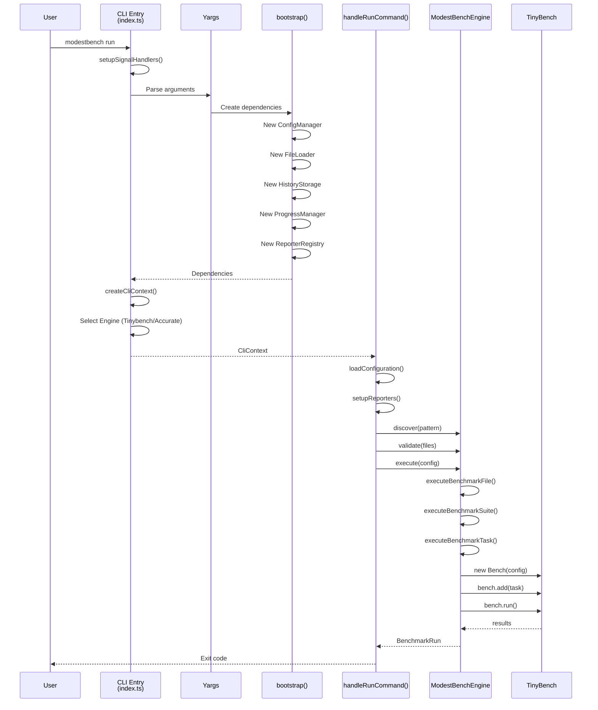

### 2.2 CLI Commands

The CLI provides the following commands:

| Command                 | Description                        | Handler File               |
| ----------------------- | ---------------------------------- | -------------------------- |
| `run [pattern..]`       | Run benchmark files (default)      | `cli/commands/run.ts`      |
| `test <framework>`      | Run test files as benchmarks       | `cli/commands/test.ts`     |
| `analyze [command]`     | CPU profiling and analysis         | `cli/commands/analyze.ts`  |
| `baseline <subcommand>` | Manage performance baselines       | `cli/commands/baseline.ts` |
| `history <subcommand>`  | View and manage benchmark history  | `cli/commands/history.ts`  |
| `init [type]`           | Initialize a new benchmark project | `cli/commands/init.ts`     |

### 2.3 Dependency Injection Pattern

The CLI creates a **CliContext** object containing all initialized services:

```typescript
export interface CliContext {
  readonly abortController: AbortController;
  readonly configManager: ConfigurationManager;
  readonly engine: BenchmarkEngine;
  readonly historyStorage: HistoryStorage;
  readonly options: GlobalOptions;
  readonly progressManager: ProgressManager;
  readonly reporterRegistry: ReporterRegistry;
}
```

This context is passed to all command handlers, enabling:

- **Testability**: Easy to mock dependencies
- **Flexibility**: Services can be swapped without changing commands
- **Separation of Concerns**: Each service has a single responsibility

---

## 3. Benchmark Engine Architecture

### 3.1 Engine Abstraction

ModestBench uses an **abstract base class pattern** to support multiple benchmark execution strategies. The architecture consists of three layers:

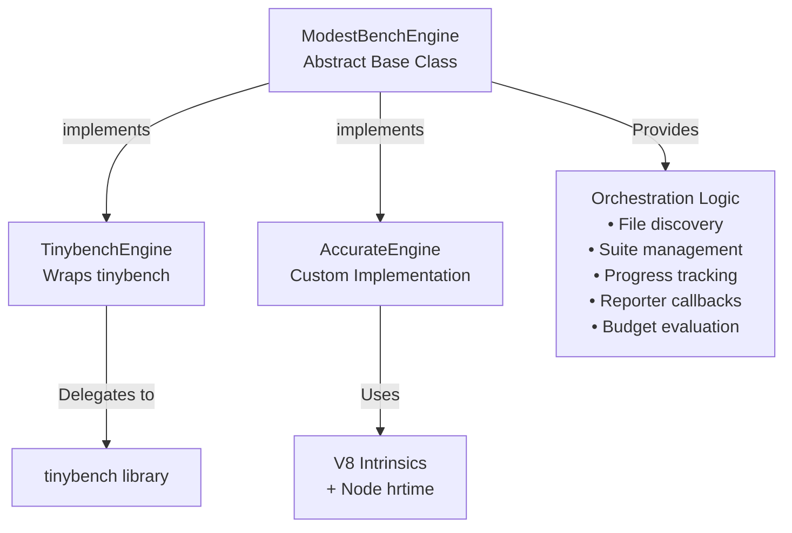

**Abstract Base Class**: `src/core/engine.ts`

- Provides **all orchestration logic**: file discovery, validation, suite/task iteration, progress tracking, reporter lifecycle
- Defines **single abstract method**: `executeBenchmarkTask()` for concrete engines to implement
- Handles setup/teardown, error recovery, history storage, budget evaluation, and result aggregation

**Concrete Implementations**: `src/core/engines/`

1. **TinybenchEngine** - Wraps external tinybench library
2. **AccurateEngine** - Custom measurement implementation with V8 optimization guards

### 3.2 TinybenchEngine: Wrapper Implementation

**Location**: `src/core/engines/tinybench-engine.ts`

**Strategy**: Thin wrapper around the [tinybench](https://github.com/tinylibs/tinybench) library

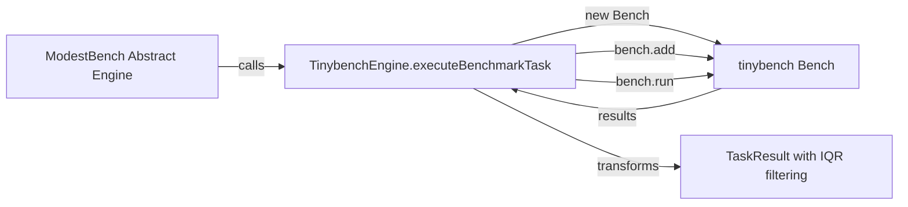

**How It Works**:

1. Creates a `Bench` instance from tinybench with configured time/iterations
2. Adds the benchmark function to the bench instance
3. Runs the benchmark (tinybench handles timing internally)
4. Extracts raw samples from tinybench results
5. **Post-processes** samples with IQR outlier removal
6. Calculates statistics from cleaned samples
7. Returns standardized `TaskResult`

**Key Features**:

- Leverages tinybench's mature timing and iteration logic
- Handles tinybench's "Invalid array length" errors for extremely fast operations (automatic retry with minimal time)
- Supports abort signals for task cancellation
- Progress updates during execution (500ms interval)

**Configuration Mapping** (`limitBy` modes):

| ModestBench Config      | TinybenchEngine Behavior                         |
| ----------------------- | ------------------------------------------------ |
| `limitBy: 'all'`        | Both time AND iterations must complete (default) |
| `limitBy: 'any'`        | Minimal time (1ms), iterations-limited           |
| `limitBy: 'time'`       | Time-limited, minimal iterations (1)             |
| `limitBy: 'iterations'` | Iterations-limited, minimal time (1ms)           |

### 3.3 AccurateEngine: Custom Implementation

**Location**: `src/core/engines/accurate-engine.ts`

**Strategy**: Custom measurement using Node.js `process.hrtime.bigint` and V8 optimization guards

**Inspiration**: Adapted from [bench-node](https://github.com/RafaelGSS/bench-node) measurement techniques

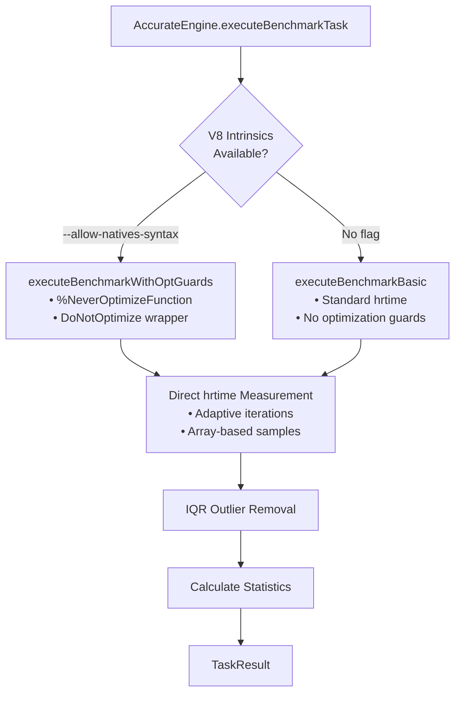

**How It Works**:

1. **Check V8 intrinsics availability** (requires `--allow-natives-syntax` flag)
2. **Calculate adaptive iterations** based on quick 30-iteration test
3. **Run optional warmup** (min 10 samples or warmup time)
4. **Main benchmark loop**:
   - Execute function N times in a batch (max 10,000 per round)
   - Time each batch with `process.hrtime.bigint`
   - Calculate per-operation duration
   - Push samples to array
   - Adjust iterations for next round based on remaining time
5. **Apply IQR outlier removal** to raw samples
6. **Calculate statistics** from cleaned samples
7. Return standardized `TaskResult`

**V8 Optimization Guards** (when available):

```typescript
// Created using V8 intrinsics
const DoNotOptimize = new Function('x', 'return x');
const NeverOptimize = new Function(
  'fn',
  '%NeverOptimizeFunction(fn); return fn;',
);

// Prevents V8 from optimizing away benchmark code
for (let i = 0; i < iterations; i++) {
  const result = fn();
  guardedDoNotOptimize(result); // Forces V8 to keep result
}
```

**Key Features**:

- **Higher accuracy** through V8 optimization guards (prevents JIT artifacts)
- **Adaptive iteration calculation** matches operation speed to target duration
- **Nanosecond precision** using BigInt hrtime
- **Fallback mode** when `--allow-natives-syntax` not available
- **Bounded iterations** (max 10,000 per round) to prevent memory issues
- **Progress updates** every 100 samples
- **Full abort signal support**

**Requirements**:

- Node.js >= 20
- `--allow-natives-syntax` flag (optional but recommended)
- Falls back gracefully without flag (prints warning once)

**Trade-offs vs TinybenchEngine**:

| Aspect          | TinybenchEngine              | AccurateEngine                                     |
| --------------- | ---------------------------- | -------------------------------------------------- |
| **Accuracy**    | Good (tinybench's timing)    | Excellent (V8 guards)                              |
| **Setup**       | No special flags needed      | Requires `--allow-natives-syntax` for best results |
| **Speed**       | Fast                         | Slower (more iterations)                           |
| **Maturity**    | Production-ready (tinybench) | Custom implementation                              |
| **Maintenance** | External dependency          | Internal code                                      |

### 3.4 Shared Post-Processing

Both engines use the **same statistical processing pipeline** (`src/core/stats-utils.ts`):

1. **IQR Outlier Removal** - Removes samples outside 1.5 \* IQR range
2. **Statistics Calculation** - mean, stdDev, variance, CV, percentiles (p95, p99)

This ensures **consistent result quality** regardless of engine choice.

---

## 4. Test Framework Adapters

### 4.1 Overview

**Location**: `src/adapters/`

ModestBench can capture test definitions from popular test frameworks and convert them to benchmarks, allowing you to measure test execution performance.

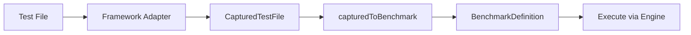

### 4.2 Supported Frameworks

| Framework     | Adapter File           | Registration File       |
| ------------- | ---------------------- | ----------------------- |
| **Mocha**     | `mocha-adapter.ts`     | N/A (global hooks)      |
| **node:test** | `node-test-adapter.ts` | `node-test-register.ts` |
| **AVA**       | `ava-adapter.ts`       | `ava-register.ts`       |
| **Jest**      | `jest-adapter.ts`      | `jest-register.ts`      |

### 4.3 Architecture

**Types**: `src/adapters/types.ts`

```typescript
interface TestFrameworkAdapter {
  readonly framework: TestFramework;
  capture(filePath: string): Promise<CapturedTestFile>;
}

interface CapturedTestFile {
  readonly filePath: string;
  readonly framework: TestFramework;
  readonly rootSuites: CapturedSuite[];
  readonly rootTests: CapturedTest[];
}
```

**Conversion Flow**:

1. Adapter intercepts test framework globals (`describe`, `it`, `test`)
2. Test definitions are captured without execution
3. `capturedToBenchmark()` converts to ModestBench format
4. Hooks (`beforeEach`, `afterEach`) are wrapped into benchmark setup/teardown

### 4.4 CLI Usage

```bash
# Run Mocha tests as benchmarks
modestbench test mocha test/*.spec.js

# Run node:test tests with custom iterations
modestbench test node-test test/*.test.js --iterations 500

# Run AVA tests
modestbench test ava test/*.js
```

---

## 5. Performance Budgets System

### 5.1 Overview

**Location**: `src/services/budget-evaluator.ts`, `src/types/budgets.ts`

Performance budgets allow setting thresholds for benchmark results, enabling CI/CD integration for performance regression detection.

### 5.2 Budget Types

```typescript
interface Budget {
  absolute?: AbsoluteBudget;
  relative?: RelativeBudget;
}

interface AbsoluteBudget {
  maxTime?: number; // Max mean execution time (ns)
  minOpsPerSec?: number; // Min operations per second
  maxP99?: number; // Max 99th percentile (ns)
}

interface RelativeBudget {
  maxRegression?: number; // Max regression vs baseline (decimal, e.g., 0.10 = 10%)
  baseline?: string; // Named baseline to compare against
}
```

### 5.3 Evaluation Flow

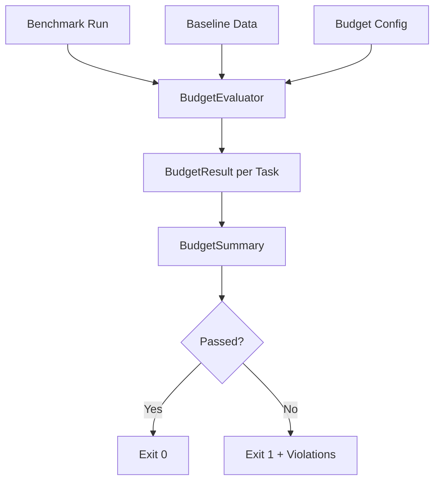

### 5.4 BudgetEvaluator Service

```typescript
class BudgetEvaluator {
  evaluateRun(
    budgets: Record<string, Budget>,
    taskResults: Map<TaskId, TaskResult>,
    baselineData?: Map<TaskId, BaselineSummaryData>,
  ): BudgetSummary;
}
```

---

## 6. Baseline Management

### 6.1 Overview

**Location**: `src/services/baseline-storage.ts`, `src/cli/commands/baseline.ts`

Baselines are named snapshots of benchmark results that serve as reference points for relative budget comparisons.

### 6.2 Storage Format

**File**: `.modestbench.baselines.json`

```typescript
interface BaselineStorage {
  version: string;
  default?: string; // Default baseline name
  baselines: Record<string, BaselineReference>;
}

interface BaselineReference {
  name: string;
  runId: RunId;
  date: Date;
  commit?: string;
  branch?: string;
  summary: Record<TaskId, BaselineSummaryData>;
}
```

### 6.3 CLI Commands

```bash
# Save current run as baseline
modestbench baseline set production-v1.0

# Set as default baseline
modestbench baseline set v1.0 --default

# List all baselines
modestbench baseline list

# Show baseline details
modestbench baseline show production-v1.0

# Delete a baseline
modestbench baseline delete old-baseline

# Analyze history to suggest budgets
modestbench baseline analyze --runs 20 --confidence 0.95
```

---

## 7. Profiling System

### 7.1 Overview

**Location**: `src/services/profiler/`, `src/cli/commands/analyze.ts`, `src/types/profiler.ts`

The profiling system allows CPU profiling of arbitrary commands and analysis of existing `.cpuprofile` files to identify benchmark candidates.

### 7.2 Architecture

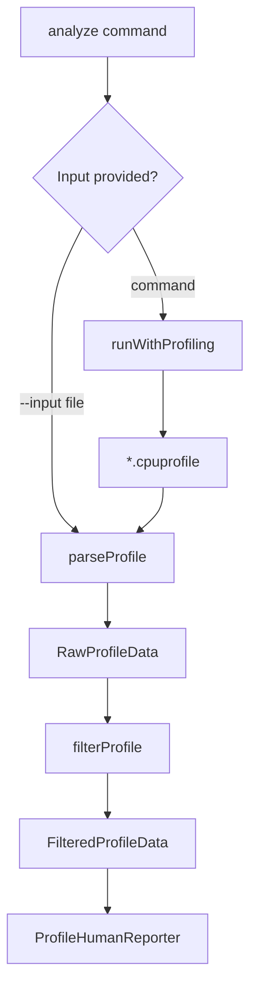

### 7.3 Services

| Service            | Location                              | Purpose                         |
| ------------------ | ------------------------------------- | ------------------------------- |
| `runWithProfiling` | `services/profiler/profile-runner.ts` | Execute command with --cpu-prof |
| `parseProfile`     | `services/profiler/profile-parser.ts` | Parse .cpuprofile files         |
| `filterProfile`    | `services/profiler/profile-filter.ts` | Filter and sort functions       |

### 7.4 CLI Usage

```bash
# Profile a command
modestbench analyze "npm test"

# Analyze existing profile
modestbench analyze --input profile.cpuprofile

# Filter by file pattern
modestbench analyze "npm test" --filter-file "src/**/*.ts"

# Show top N functions
modestbench analyze "npm test" --top 50 --min-percent 1.0
```

---

## 8. Reporters

### 8.1 Available Reporters

**Location**: `src/reporters/`

| Reporter                 | File               | Description                               |
| ------------------------ | ------------------ | ----------------------------------------- |
| **HumanReporter**        | `human.ts`         | Rich terminal output with colors/progress |
| **JsonReporter**         | `json.ts`          | Machine-readable JSON output              |
| **CsvReporter**          | `csv.ts`           | Tabular CSV format                        |
| **SimpleReporter**       | `simple.ts`        | Plain text, no colors (CI-friendly)       |
| **NyanReporter**         | `nyan.ts`          | Animated nyan cat rainbow reporter        |
| **ProfileHumanReporter** | `profile-human.ts` | Human-readable CPU profile output         |

### 8.2 Reporter Lifecycle

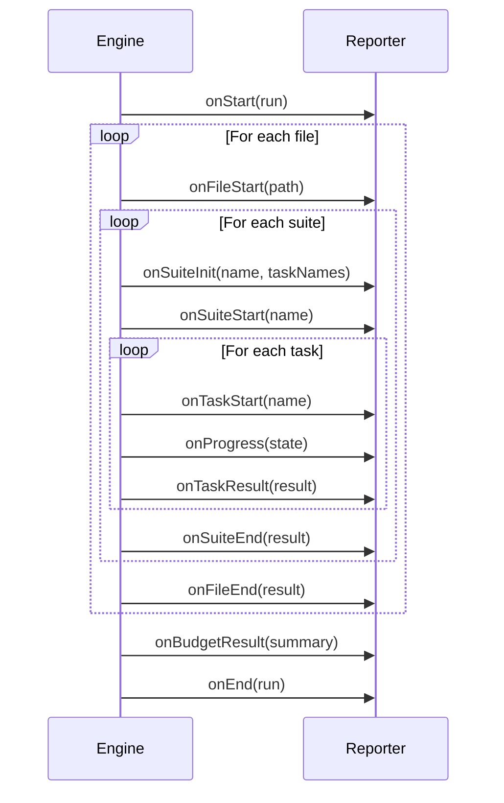

### 8.3 Reporter Interface

```typescript
interface Reporter {
  onStart(run: BenchmarkRun): Promise<void> | void;
  onEnd(run: BenchmarkRun): Promise<void> | void;
  onError(error: Error): Promise<void> | void;
  onTaskResult(result: TaskResult): Promise<void> | void;

  // Optional methods
  onFileStart?(file: string): Promise<void> | void;
  onFileEnd?(result: FileResult): Promise<void> | void;
  onSuiteInit?(
    suite: string,
    taskNames: readonly string[],
  ): Promise<void> | void;
  onSuiteStart?(suite: string): Promise<void> | void;
  onSuiteEnd?(result: SuiteResult): Promise<void> | void;
  onTaskStart?(task: string): Promise<void> | void;
  onProgress?(state: ProgressState): Promise<void> | void;
  onBudgetResult?(summary: BudgetSummary): Promise<void> | void;
}
```

---

## 9. History System

### 9.1 Overview

The history system provides **persistent storage** of benchmark runs with querying, trend analysis, cleanup, and export capabilities.

**Implementation**: `src/services/history-storage.ts`

### 9.2 Storage Architecture

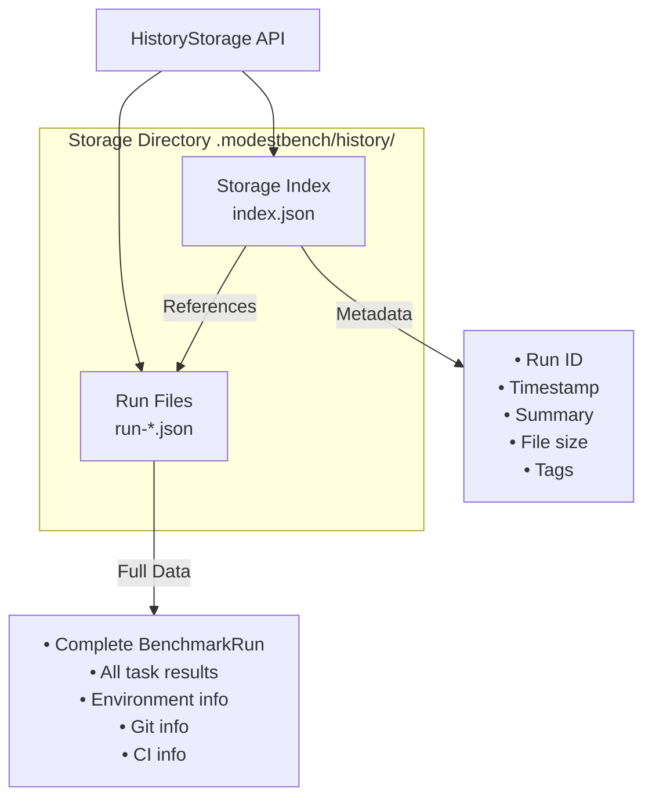

### 9.3 History Formatters

**Location**: `src/formatters/history/`

| Formatter            | File               | Purpose                       |
| -------------------- | ------------------ | ----------------------------- |
| **ListFormatter**    | `list.ts`          | Format run listings           |
| **ShowFormatter**    | `show.ts`          | Format single run details     |
| **CompareFormatter** | `compare.ts`       | Format run comparisons        |
| **TrendsFormatter**  | `trends.ts`        | Format trend analysis results |
| **Visualization**    | `visualization.ts` | Terminal charts and graphs    |

### 9.4 Trend Analysis

**Location**: `src/services/history/trend-analysis.ts`

```typescript
class TrendAnalysisService {
  analyzeTrends(runs: BenchmarkRun[]): TrendsResult;
}

interface TrendsResult {
  trends: TrendData[];
  summary: {
    totalTasks: number;
    improvingTasks: number;
    stableTasks: number;
    degradingTasks: number;
  };
  regressions: TrendData[];
  lowConfidenceRegressions: TrendData[];
  timespan: { start: Date; end: Date };
  runs: number;
}
```

**Trend Classification**:

- **Improving**: Negative slope (values decreasing = faster)
- **Stable**: Slope within 5% of mean
- **Degrading**: Positive slope (values increasing = slower)

### 9.5 CLI Commands

```bash
# List recent runs
modestbench history list --since "1 week ago"

# Show run details
modestbench history show abc123

# Compare two runs
modestbench history compare abc123 def456

# Analyze trends
modestbench history trends --since "1 month ago"

# Clean old history
modestbench history clean --max-runs 50 --yes

# Export to file
modestbench history export -o history.json
```

---

## 10. Error Handling

### 10.1 Error Architecture

**Location**: `src/errors/`

All errors extend `ModestBenchError` and include error codes and documentation URLs.

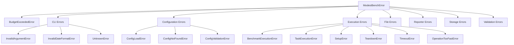

### 10.2 Error Files

| File               | Error Types                                                       |
| ------------------ | ----------------------------------------------------------------- |
| `base.ts`          | `ModestBenchError`, `ModestBenchAggregateError`                   |
| `budget.ts`        | `BudgetExceededError`                                             |
| `cli.ts`           | `InvalidArgumentError`, `InvalidDateFormatError`, `UnknownError`  |
| `configuration.ts` | `ConfigLoadError`, `ConfigNotFoundError`, `ConfigValidationError` |
| `execution.ts`     | `BenchmarkExecutionError`, `TaskExecutionError`, `TimeoutError`   |
| `file.ts`          | `FileDiscoveryError`, `FileLoadError`, `FileNotFoundError`        |
| `reporter.ts`      | `ReporterAlreadyRegisteredError`, `UnknownReporterError`          |
| `storage.ts`       | `StorageError`, `StorageCorruptionError`, `StorageIndexError`     |
| `validation.ts`    | `SchemaValidationError`, `StructureValidationError`               |

### 10.3 Error Codes

All error codes are defined in `src/constants.ts`:

```typescript
export const ErrorCodes = {
  BUDGET_EXCEEDED: 'ERR_MB_BUDGET_EXCEEDED',
  CLI_INVALID_ARGUMENT: 'ERR_MB_CLI_INVALID_ARGUMENT',
  CONFIG_LOAD_FAILED: 'ERR_MB_CONFIG_LOAD_FAILED',
  EXECUTION_TIMEOUT: 'ERR_MB_EXECUTION_TIMEOUT',
  FILE_NOT_FOUND: 'ERR_MB_FILE_NOT_FOUND',
  STORAGE_FAILED: 'ERR_MB_STORAGE_FAILED',
  // ... etc
} as const;
```

---

## 11. Configuration System

### 11.1 Overview

**Location**: `src/services/config-manager.ts`, `src/config/schema.ts`

Uses [cosmiconfig](https://github.com/cosmiconfig/cosmiconfig) for configuration discovery and [Zod](https://github.com/colinhacks/zod) for validation.

### 11.2 Search Locations

```typescript
const searchPlaces = [
  'package.json',
  '.modestbenchrc',
  '.modestbenchrc.json',
  '.modestbenchrc.yaml',
  '.modestbenchrc.yml',
  'modestbench.config.json',
  'modestbench.config.yaml',
  'modestbench.config.yml',
  'modestbench.config.js',
  'modestbench.config.mjs',
  'modestbench.config.ts',
];
```

### 11.3 Configuration Schemas

**Location**: `src/config/schema.ts`, `src/config/budget-schema.ts`

```typescript
// Main configuration schema (Zod)
const ModestBenchConfigSchema = z.object({
  pattern: z.union([z.string(), z.array(z.string())]),
  exclude: z.array(z.string()).optional(),
  iterations: z.number().int().positive(),
  time: z.number().positive(),
  warmup: z.number().int().nonnegative(),
  timeout: z.number().positive(),
  bail: z.boolean(),
  limitBy: z.enum(['time', 'iterations', 'any', 'all']),
  budgets: z.record(BudgetSchema).optional(),
  // ... more options
});
```

---

## 12. Programmatic API

### 12.1 API Entry Point

**Location**: `src/index.ts`

ModestBench exports a complete programmatic API:

```typescript
// Main bootstrap function
export { bootstrap as modestbench } from './bootstrap.js';

// Core engine
export { ModestBenchEngine } from './core/engine.js';
export { AccurateEngine, TinybenchEngine } from './core/engines/index.js';

// Statistical utilities
export { calculateStatistics, removeOutliersIQR } from './core/stats-utils.js';

// Services
export { ModestBenchConfigurationManager } from './services/config-manager.js';
export { BenchmarkFileLoader } from './services/file-loader.js';
export { FileHistoryStorage } from './services/history-storage.js';
export { ModestBenchProgressManager } from './services/progress-manager.js';
export {
  ModestBenchReporterRegistry,
  BaseReporter,
  CompositeReporter,
} from './services/reporter-registry.js';

// Profiler services
export { runWithProfiling } from './services/profiler/profile-runner.js';
export { parseProfile } from './services/profiler/profile-parser.js';
export { filterProfile } from './services/profiler/profile-filter.js';

// Reporters
export { HumanReporter } from './reporters/human.js';
export { JsonReporter } from './reporters/json.js';
export { CsvReporter } from './reporters/csv.js';
export { ProfileHumanReporter } from './reporters/profile-human.js';

// Error classes
export * from './errors/index.js';

// All types
export * from './types/index.js';

// Utilities
export { findPackageRoot } from './utils/package.js';
```

### 12.2 Usage Example

```typescript
import { TinybenchEngine, bootstrap, HumanReporter } from 'modestbench';

// Bootstrap all dependencies
const deps = bootstrap();

// Create engine
const engine = new TinybenchEngine(deps);

// Register reporters
engine.registerReporter('human', new HumanReporter({ color: true }));

// Execute benchmarks
const result = await engine.execute({
  pattern: '**/*.bench.js',
  iterations: 1000,
});
```

---

## 13. Directory Structure

```text
src/
├── adapters/               # Test framework adapters
│   ├── ava-adapter.ts
│   ├── ava-hooks.ts
│   ├── ava-register.ts
│   ├── jest-adapter.ts
│   ├── jest-hooks.ts
│   ├── jest-register.ts
│   ├── mocha-adapter.ts
│   ├── node-test-adapter.ts
│   ├── node-test-hooks.ts
│   ├── node-test-register.ts
│   └── types.ts
├── bootstrap.ts            # Dependency injection setup
├── cli/
│   ├── commands/
│   │   ├── analyze.ts      # CPU profiling command
│   │   ├── baseline.ts     # Baseline management
│   │   ├── history.ts      # History commands
│   │   ├── init.ts         # Project initialization
│   │   ├── run.ts          # Main benchmark runner
│   │   └── test.ts         # Test-as-benchmark command
│   └── index.ts            # CLI entry point
├── config/
│   ├── budget-schema.ts    # Budget configuration schema
│   └── schema.ts           # Main config schema (Zod)
├── constants.ts            # Exit codes, error codes, defaults
├── core/
│   ├── benchmark-schema.ts # Benchmark file schema
│   ├── engine.ts           # Abstract benchmark engine
│   ├── engines/
│   │   ├── accurate-engine.ts
│   │   ├── index.ts
│   │   └── tinybench-engine.ts
│   ├── output-path-resolver.ts
│   └── stats-utils.ts      # Statistical calculations
├── errors/                 # Structured error classes
│   ├── base.ts
│   ├── budget.ts
│   ├── cli.ts
│   ├── configuration.ts
│   ├── execution.ts
│   ├── file.ts
│   ├── index.ts
│   ├── reporter.ts
│   ├── storage.ts
│   └── validation.ts
├── formatters/             # History output formatters
│   └── history/
│       ├── base.ts
│       ├── compare.ts
│       ├── list.ts
│       ├── show.ts
│       ├── trends.ts
│       └── visualization.ts
├── index.ts                # Public API exports
├── reporters/
│   ├── csv.ts
│   ├── human.ts
│   ├── index.ts
│   ├── json.ts
│   ├── nyan.ts             # Nyan cat reporter
│   ├── profile-human.ts    # CPU profile reporter
│   └── simple.ts           # Plain text reporter
├── services/
│   ├── baseline-storage.ts # Named baseline management
│   ├── budget-evaluator.ts # Performance budget evaluation
│   ├── config-manager.ts   # Configuration loading
│   ├── file-loader.ts      # Benchmark file discovery
│   ├── history/
│   │   ├── comparison.ts
│   │   ├── models.ts
│   │   ├── query.ts
│   │   └── trend-analysis.ts
│   ├── history-storage.ts  # Run persistence
│   ├── profiler/
│   │   ├── profile-filter.ts
│   │   ├── profile-parser.ts
│   │   └── profile-runner.ts
│   ├── progress-manager.ts
│   └── reporter-registry.ts
├── types/
│   ├── budgets.ts          # Budget-related types
│   ├── core.ts             # Core types (Run, Result, etc.)
│   ├── index.ts
│   ├── interfaces.ts       # Service interfaces
│   ├── profiler.ts         # Profiler types
│   └── utility.ts          # Utility types
└── utils/
    ├── ansi.ts             # ANSI color utilities
    ├── identifiers.ts      # ID generation
    ├── package.ts          # Package.json utilities
    └── type-guards.ts      # Type guard functions
```

---

## 14. Source Code Reference Map

| Subsystem        | Primary File                              | Lines | Key Classes/Functions                         |
| ---------------- | ----------------------------------------- | ----- | --------------------------------------------- |
| CLI Entry        | `src/cli/index.ts`                        | ~1250 | `cli()`, `main()`, `createCliContext()`       |
| Run Command      | `src/cli/commands/run.ts`                 | ~500  | `handleRunCommand()`                          |
| Test Command     | `src/cli/commands/test.ts`                | ~550  | `handleTestCommand()`                         |
| Analyze Command  | `src/cli/commands/analyze.ts`             | ~200  | `handleAnalyzeCommand()`                      |
| Baseline Command | `src/cli/commands/baseline.ts`            | ~400  | `handleSetCommand()`, `handleListCommand()`   |
| Engine Base      | `src/core/engine.ts`                      | ~1000 | `ModestBenchEngine` (abstract)                |
| Tinybench        | `src/core/engines/tinybench-engine.ts`    | ~350  | `TinybenchEngine`                             |
| Accurate         | `src/core/engines/accurate-engine.ts`     | ~410  | `AccurateEngine`                              |
| Stats            | `src/core/stats-utils.ts`                 | ~150  | `calculateStatistics`, `removeOutliersIQR`    |
| Config           | `src/services/config-manager.ts`          | ~470  | `ModestBenchConfigurationManager`             |
| File Loader      | `src/services/file-loader.ts`             | ~420  | `BenchmarkFileLoader`                         |
| History          | `src/services/history-storage.ts`         | ~610  | `FileHistoryStorage`                          |
| Baseline         | `src/services/baseline-storage.ts`        | ~200  | `BaselineStorageService`                      |
| Budget           | `src/services/budget-evaluator.ts`        | ~185  | `BudgetEvaluator`                             |
| Progress         | `src/services/progress-manager.ts`        | ~415  | `ModestBenchProgressManager`                  |
| Trend Analysis   | `src/services/history/trend-analysis.ts`  | ~240  | `TrendAnalysisService`                        |
| Profile Runner   | `src/services/profiler/profile-runner.ts` | ~125  | `runWithProfiling()`                          |
| Human Reporter   | `src/reporters/human.ts`                  | ~600  | `HumanReporter`                               |
| Nyan Reporter    | `src/reporters/nyan.ts`                   | ~410  | `NyanReporter`                                |
| Simple Reporter  | `src/reporters/simple.ts`                 | ~550  | `SimpleReporter`                              |
| Adapters Types   | `src/adapters/types.ts`                   | ~290  | `TestFrameworkAdapter`, `capturedToBenchmark` |
| Types            | `src/types/`                              | ~700  | Interface definitions                         |
| Errors           | `src/errors/`                             | ~500  | All error classes                             |

**Total Source Code**: ~11,000 lines

---

## 15. Environment Variable Behaviors

### 15.1 Environment Variables Used

| Variable           | Purpose                     | Location                 | Default         | Impact                     |
| ------------------ | --------------------------- | ------------------------ | --------------- | -------------------------- |
| `DEBUG`            | Show stack traces on errors | `src/cli/index.ts`       | `undefined`     | Error verbosity            |
| `CI`               | Detect CI environment       | `src/core/engine.ts`     | `'false'`       | Enable CI info collection  |
| `NODE_ENV`         | Environment mode            | `src/core/engine.ts`     | `'development'` | Stored in environment info |
| `FORCE_COLOR`      | Force color output          | `src/reporters/human.ts` | `undefined`     | Override color detection   |
| `NO_COLOR`         | Disable color output        | `src/reporters/human.ts` | `undefined`     | Override color detection   |
| **GitHub Actions** | CI provider detection       | `src/core/engine.ts`     | N/A             | See below                  |

### 15.2 CI Detection

When `GITHUB_ACTIONS` is set, captures:

| GitHub Variable     | ModestBench Field        | Purpose            |
| ------------------- | ------------------------ | ------------------ |
| `GITHUB_RUN_NUMBER` | `buildNumber`            | Job number         |
| `GITHUB_REPOSITORY` | Used to build `buildUrl` | e.g., `owner/repo` |
| `GITHUB_RUN_ID`     | Used to build `buildUrl` | Job run ID         |
| `GITHUB_REF_NAME`   | `branch`                 | Branch or PR ref   |
| `GITHUB_EVENT_NAME` | Determines `pullRequest` | Event type         |
| `GITHUB_SHA`        | `commit`                 | Commit SHA         |

---

## 16. Key Architectural Decisions

### 16.1 Engine Abstraction Pattern

**Why**: Support multiple benchmark execution strategies without code duplication  
**How**: Abstract base class with single `executeBenchmarkTask()` hook  
**Trade-off**: Easier to add new engines, but requires understanding the abstraction

### 16.2 Dependency Injection

**Why**: Enables testing and flexibility  
**How**: Services passed via `bootstrap()` and `createCliContext()`  
**Trade-off**: More verbose setup for programmatic use

### 16.3 Branded Types for IDs

**Why**: Prevent accidental mixing of `RunId` and `TaskId`  
**How**: TypeScript branded types (`string & { __brand: 'RunId' }`)  
**Trade-off**: Requires explicit creation functions

### 16.4 Cosmiconfig for Configuration

**Why**: Standard tool used by ESLint, Prettier, Babel  
**How**: Automatic discovery of config files in multiple formats  
**Trade-off**: External dependency, but well-maintained

### 16.5 Zod for Schema Validation

**Why**: Type-safe schema validation with inference  
**How**: Schemas define configuration structure and generate types  
**Trade-off**: Runtime overhead, but provides better error messages

### 16.6 Service Layer Consolidation

**Why**: Clear separation between CLI, core, and services  
**How**: All services in `src/services/` directory  
**Trade-off**: More files, but better organization

---

## 17. Testing Strategy

### 17.1 Test Organization

**Location**: `/test/`

**Structure**:

- `unit/` - Pure function tests
- `integration/` - Component interaction tests
- `contract/` - Interface compliance tests

### 17.2 Key Test Files

| Test File                                     | Coverage                       |
| --------------------------------------------- | ------------------------------ |
| `test/contract/tinybench-engine.test.ts`      | TinybenchEngine implementation |
| `test/contract/accurate-engine.test.ts`       | AccurateEngine implementation  |
| `test/integration/engine-comparison.test.ts`  | Engine compatibility           |
| `test/integration/test_reporters.test.ts`     | Reporter output                |
| `test/integration/test_configuration.test.ts` | Config loading                 |

### 17.3 Engine Contract Testing

Both concrete engines (`TinybenchEngine` and `AccurateEngine`) are tested against the same contract to ensure API compatibility.

---

## 18. Glossary

| Term                | Definition                                             |
| ------------------- | ------------------------------------------------------ |
| **Benchmark Run**   | Complete execution of all discovered benchmark files   |
| **Suite**           | Collection of related benchmark tasks                  |
| **Task**            | Single benchmark operation (one function to measure)   |
| **Reporter**        | Output formatter (human, JSON, CSV, nyan, simple)      |
| **History Storage** | Persistent benchmark result storage                    |
| **Baseline**        | Named reference snapshot for budget comparisons        |
| **Budget**          | Performance threshold (absolute or relative)           |
| **Progress State**  | Real-time execution progress tracking                  |
| **TaskId**          | Unique identifier: `{filePath}/{suiteName}/{taskName}` |
| **RunId**           | 7-character alphanumeric run identifier                |
| **TinyBench**       | External benchmark library wrapped by TinybenchEngine  |
| **AccurateEngine**  | Custom benchmark engine with V8 optimization guards    |
| **TinybenchEngine** | Engine that wraps the tinybench library                |
| **IQR Filtering**   | Interquartile Range outlier removal for sample cleanup |
| **V8 Intrinsics**   | Low-level V8 functions for optimization control        |
| **CliContext**      | Dependency injection container for CLI commands        |
| **Test Adapter**    | Converts test framework definitions to benchmarks      |
| **Trend Analysis**  | Statistical analysis of performance changes over time  |

---

This architectural overview provides a comprehensive understanding of ModestBench's internal structure, design decisions, and capabilities. The system is well-architected with clear separation of concerns through the engine abstraction pattern, service layer consolidation, and comprehensive feature set for performance testing.
