# ModestBench Architectural Overview

## Executive Summary

**ModestBench** is a TypeScript-based benchmarking framework that wraps [tinybench](https://github.com/tinylibs/tinybench) to provide structure, CLI tooling, historical tracking, and multiple output formats for JavaScript/TypeScript performance testing. The architecture follows a dependency injection pattern with clear separation of concerns across subsystems.

**Core Technology**: Node.js 18+, TypeScript, tinybench 2.6.0

**Key Dependencies**:

- `tinybench` - Core benchmarking engine
- `yargs` - CLI argument parsing
- `glob` - File discovery
- `cli-progress` - Terminal progress bars
- `consola` - Logging

---

## 1. System Architecture Overview

### 1.1 High-Level Subsystems

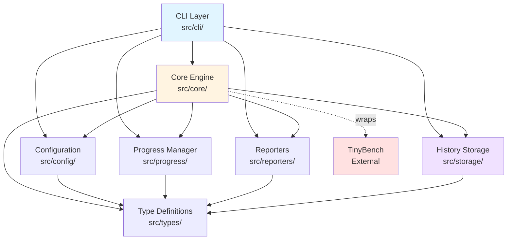

### 1.2 Subsystem Breakdown

| Subsystem     | Purpose                                    | Key Files                                                         | Stateful?           |
| ------------- | ------------------------------------------ | ----------------------------------------------------------------- | ------------------- |
| **CLI**       | Command-line interface and command routing | `cli/index.ts`<br/>`cli/commands/*.ts`                            | No                  |
| **Core**      | Benchmark orchestration and execution      | `core/engine.ts`<br/>`core/loader.ts`<br/>`core/error-manager.ts` | Yes (ErrorManager)  |
| **Config**    | Configuration loading and merging          | `config/manager.ts`                                               | No                  |
| **Progress**  | Real-time progress tracking                | `progress/manager.ts`                                             | Yes                 |
| **Reporters** | Output formatting (human/JSON/CSV)         | `reporters/*.ts`                                                  | Yes (HumanReporter) |
| **Storage**   | Historical benchmark data persistence      | `storage/history.ts`                                              | Yes                 |
| **Types**     | TypeScript interfaces and types            | `types/*.ts`                                                      | No                  |

---

## 2. Control Flow from CLI Entry Point

### 2.1 Application Bootstrap

**Entry Point**: `src/cli/index.ts`

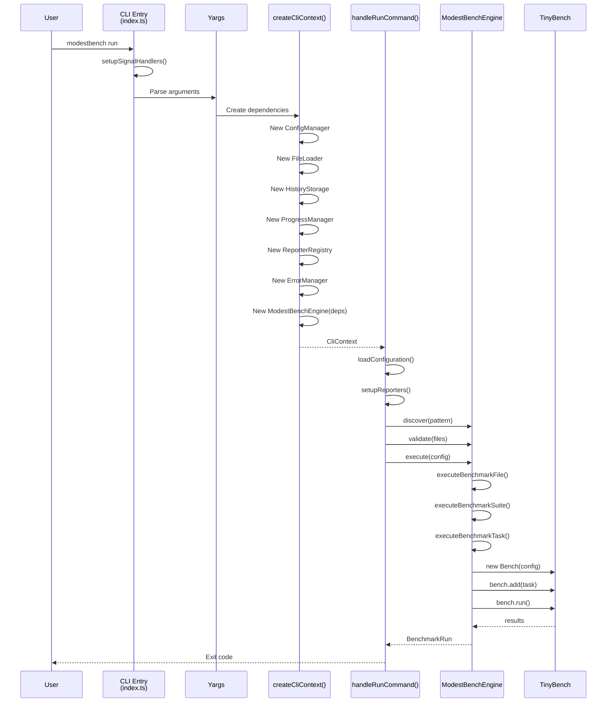

### 2.2 Detailed Run Command Flow

**Source**: `src/cli/commands/run.ts`

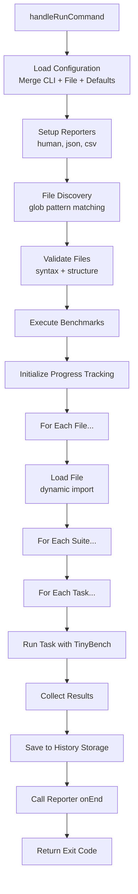

### 2.3 Dependency Injection Pattern

The CLI creates a **CliContext** object (lines 44-52 in `src/cli/index.ts`) containing all initialized services:

```typescript
export interface CliContext {
  readonly configManager: ConfigurationManager;
  readonly engine: BenchmarkEngine;
  readonly errorManager: ErrorManager;
  readonly historyStorage: HistoryStorage;
  readonly options: GlobalOptions;
  readonly progressManager: ProgressManager;
  readonly reporterRegistry: ReporterRegistry;
}
```

This context is passed to all command handlers, enabling:

- **Testability**: Easy to mock dependencies
- **Flexibility**: Services can be swapped without changing commands
- **Separation of Concerns**: Each service has a single responsibility

---

## 3. Benchmark Engine Architecture

### 3.1 Engine Abstraction

ModestBench uses an **abstract base class pattern** to support multiple benchmark execution strategies. The architecture consists of three layers:

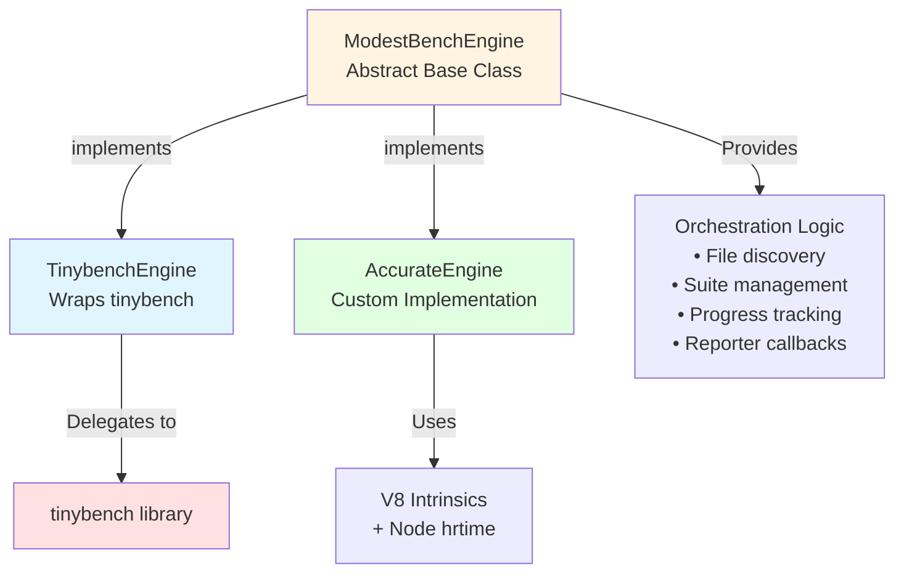

**Abstract Base Class**: `src/core/engine.ts`

- Provides **all orchestration logic**: file discovery, validation, suite/task iteration, progress tracking, reporter lifecycle
- Defines **single abstract method**: `executeBenchmarkTask()` for concrete engines to implement
- Handles setup/teardown, error recovery, history storage, and result aggregation

**Concrete Implementations**: `src/core/engines/`

1. **TinybenchEngine** - Wraps external tinybench library
2. **AccurateEngine** - Custom measurement implementation with V8 optimization guards

### 3.2 TinybenchEngine: Wrapper Implementation

**Location**: `src/core/engines/tinybench-engine.ts`

**Strategy**: Thin wrapper around the [tinybench](https://github.com/tinylibs/tinybench) library

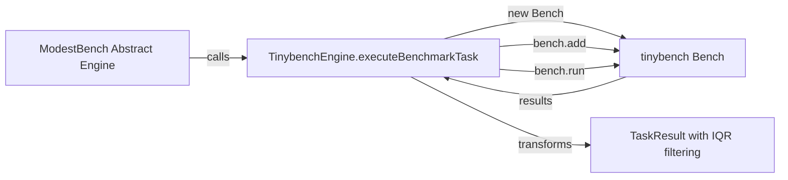

**How It Works**:

1. Creates a `Bench` instance from tinybench with configured time/iterations
2. Adds the benchmark function to the bench instance
3. Runs the benchmark (tinybench handles timing internally)
4. Extracts raw samples from tinybench results
5. **Post-processes** samples with IQR outlier removal
6. Calculates statistics from cleaned samples
7. Returns standardized `TaskResult`

**Key Features**:

- Leverages tinybench's mature timing and iteration logic
- Handles tinybench's "Invalid array length" errors for extremely fast operations (automatic retry with minimal time)
- Supports abort signals for task cancellation
- Progress updates during execution (500ms interval)

**Configuration Mapping** (`limitBy` modes):

| ModestBench Config      | TinybenchEngine Behavior                         |
| ----------------------- | ------------------------------------------------ |
| `limitBy: 'all'`        | Both time AND iterations must complete (default) |
| `limitBy: 'any'`        | Minimal time (1ms), iterations-limited           |
| `limitBy: 'time'`       | Time-limited, minimal iterations (1)             |
| `limitBy: 'iterations'` | Iterations-limited, minimal time (1ms)           |

### 3.3 AccurateEngine: Custom Implementation

**Location**: `src/core/engines/accurate-engine.ts`

**Strategy**: Custom measurement using Node.js `process.hrtime.bigint` and V8 optimization guards

**Inspiration**: Adapted from [bench-node](https://github.com/RafaelGSS/bench-node) measurement techniques

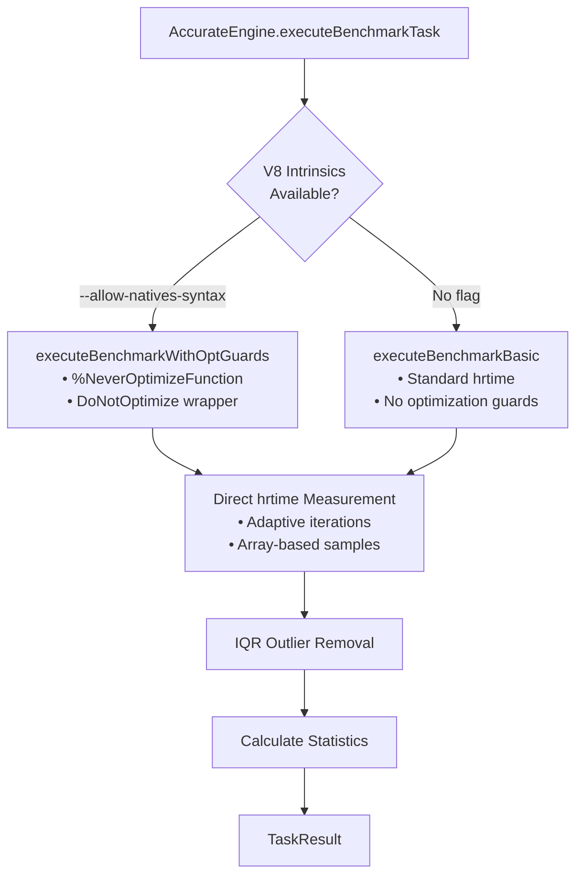

**How It Works**:

1. **Check V8 intrinsics availability** (requires `--allow-natives-syntax` flag)
2. **Calculate adaptive iterations** based on quick 30-iteration test
3. **Run optional warmup** (min 10 samples or warmup time)
4. **Main benchmark loop**:
   - Execute function N times in a batch (max 10,000 per round)
   - Time each batch with `process.hrtime.bigint`
   - Calculate per-operation duration
   - Push samples to array
   - Adjust iterations for next round based on remaining time
5. **Apply IQR outlier removal** to raw samples
6. **Calculate statistics** from cleaned samples
7. Return standardized `TaskResult`

**V8 Optimization Guards** (when available):

```typescript
// Created using V8 intrinsics
const DoNotOptimize = new Function('x', 'return x');
const NeverOptimize = new Function(
  'fn',
  '%NeverOptimizeFunction(fn); return fn;',
);

// Prevents V8 from optimizing away benchmark code
for (let i = 0; i < iterations; i++) {
  const result = fn();
  guardedDoNotOptimize(result); // Forces V8 to keep result
}
```

**Key Features**:

- **Higher accuracy** through V8 optimization guards (prevents JIT artifacts)
- **Adaptive iteration calculation** matches operation speed to target duration
- **Nanosecond precision** using BigInt hrtime
- **Fallback mode** when `--allow-natives-syntax` not available
- **Bounded iterations** (max 10,000 per round) to prevent memory issues
- **Progress updates** every 100 samples
- **Full abort signal support**

**Requirements**:

- Node.js >= 20
- `--allow-natives-syntax` flag (optional but recommended)
- Falls back gracefully without flag (prints warning once)

**Trade-offs vs TinybenchEngine**:

| Aspect          | TinybenchEngine              | AccurateEngine                                     |
| --------------- | ---------------------------- | -------------------------------------------------- |
| **Accuracy**    | Good (tinybench's timing)    | Excellent (V8 guards)                              |
| **Setup**       | No special flags needed      | Requires `--allow-natives-syntax` for best results |
| **Speed**       | Fast                         | Slower (more iterations)                           |
| **Maturity**    | Production-ready (tinybench) | Custom implementation                              |
| **Maintenance** | External dependency          | Internal code                                      |

### 3.4 Shared Post-Processing

Both engines use the **same statistical processing pipeline** (`src/core/stats-utils.ts`):

1. **IQR Outlier Removal** - Removes samples outside 1.5 \* IQR range
2. **Statistics Calculation** - mean, stdDev, variance, CV, percentiles (p95, p99)

This ensures **consistent result quality** regardless of engine choice.

---

## 4. Interface Points with TinyBench

### 4.1 Integration Layer

**Location**: `src/core/engines/tinybench-engine.ts` (lines 27-334)

ModestBench wraps TinyBench at the **task execution level** only. The integration is isolated to the `TinybenchEngine.executeBenchmarkTask()` method:

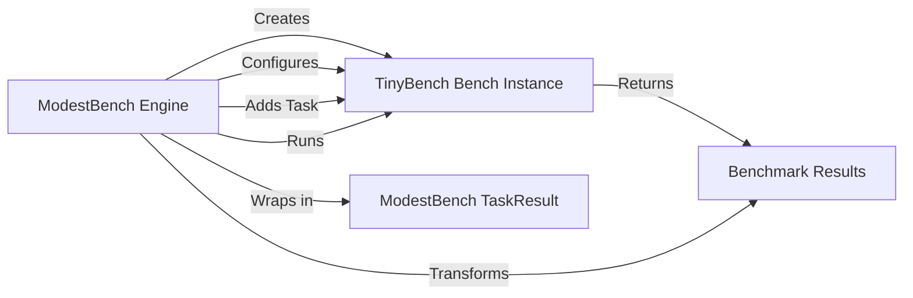

### 4.2 Configuration Mapping

TinybenchEngine maps ModestBench configuration to TinyBench options:

| ModestBench Config | TinyBench Option | Default      | Notes                                                   |
| ------------------ | ---------------- | ------------ | ------------------------------------------------------- |
| `time`             | `time`           | 1000ms       | Capped at 2000ms to prevent overflow                    |
| `warmup`           | `warmupTime`     | 0            | Warmup duration in ms, capped at 500ms                  |
| `iterations`       | `iterations`     | 100          | Direct mapping                                          |
| `limitBy`          | N/A              | 'iterations' | Controls how time/iterations interact (see section 3.2) |
| `timeout`          | N/A              | 30000ms      | Enforced at task level, not TinyBench                   |

**Source**: `src/core/engines/tinybench-engine.ts` (lines 77-82)

```typescript
const bench = new Bench({
  iterations: effectiveIterations,
  time: effectiveTime,
  warmupIterations: config.warmup,
  warmupTime: config.warmup > 0 ? Math.min(config.warmup || 0, 500) : 0,
});
```

### 4.3 Result Transformation

TinyBench returns results with the following structure, which TinybenchEngine transforms:

**TinyBench → ModestBench Mapping**:

| TinyBench Field                      | ModestBench Field | Transformation                  |
| ------------------------------------ | ----------------- | ------------------------------- |
| `latency.samples`                    | `samples`         | Converted ms → ns, IQR filtered |
| `latency.samples` (filtered)         | `mean`            | Calculated from cleaned samples |
| `latency.samples` (filtered)         | `min`             | Calculated from cleaned samples |
| `latency.samples` (filtered)         | `max`             | Calculated from cleaned samples |
| `latency.samples` (filtered)         | `stdDev`          | Calculated from cleaned samples |
| `latency.samples` (filtered)         | `variance`        | Calculated from cleaned samples |
| `latency.samples` (filtered)         | `p95`             | Calculated from cleaned samples |
| `latency.samples` (filtered)         | `p99`             | Calculated from cleaned samples |
| `latency.samples` (filtered)         | `cv`              | Calculated from cleaned samples |
| `latency.samples` (filtered)         | `marginOfError`   | Calculated from cleaned samples |
| `throughput.mean`                    | `opsPerSecond`    | Direct from tinybench           |
| `latency.samples.length` (after IQR) | `iterations`      | After outlier removal           |

**Note**: TinybenchEngine applies **IQR outlier removal** to raw samples before calculating most statistics. Only `opsPerSecond` comes directly from tinybench.

**Source**: `src/core/engines/tinybench-engine.ts` (lines 287-310)

### 4.4 Error Handling

TinybenchEngine implements special error handling for TinyBench edge cases:

**Array Length Overflow**: When operations are extremely fast (<1ns), TinyBench can throw "Invalid array length" errors. TinybenchEngine automatically retries with minimal time (1-10ms depending on `limitBy` mode) and gracefully reports if still failing.

**Source**: `src/core/engines/tinybench-engine.ts` (lines 98-178)

```typescript
catch (error) {
  if (errorMessage.includes('Invalid array length')) {
    // Retry with minimal time for extremely fast operations
    const minimalBench = new Bench({ time: retryTime, iterations: config.iterations });
    await minimalBench.run();
    // ... apply IQR and return results
  }
}
```

---

## 5. Programmatic API

### 5.1 API Entry Point

ModestBench **does not currently expose a documented programmatic API** for library consumers. The CLI is the primary interface.

However, the architecture supports programmatic use through the exported engine:

**Potential API Usage** (not officially documented):

```typescript
import { TinybenchEngine, AccurateEngine } from 'modestbench';
import {
  ModestBenchConfigurationManager,
  BenchmarkFileLoader,
  FileHistoryStorage,
  ModestBenchProgressManager,
  ModestBenchReporterRegistry,
  ModestBenchErrorManager,
} from 'modestbench';

// Manual setup required
const engine = new TinybenchEngine({
  // or new AccurateEngine({
  configManager: new ModestBenchConfigurationManager(),
  fileLoader: new BenchmarkFileLoader(),
  historyStorage: new FileHistoryStorage(),
  progressManager: new ModestBenchProgressManager(),
  reporterRegistry: new ModestBenchReporterRegistry(),
  errorManager: new ModestBenchErrorManager(),
});

// Execute benchmarks
const result = await engine.execute({
  pattern: '**/*.bench.js',
  iterations: 1000,
});
```

### 5.2 Export Structure

**Package Exports** (`package.json` lines 24-30):

```json
{
  "exports": {
    ".": {
      "import": "./dist/index.js",
      "require": "./dist/index.cjs",
      "types": "./dist/index.d.cts"
    }
  },
  "main": "./dist/index.cjs",
  "module": "./dist/index.js",
  "types": "./dist/index.d.cts"
}
```

The project currently does **not have an `src/index.ts`** file that aggregates exports for library consumers. This would need to be created to support programmatic API usage.

### 5.3 Recommendation: Create Public API

**Opinion**: To support programmatic usage, create `src/index.ts`:

```typescript
// Proposed src/index.ts
export { ModestBenchEngine } from './core/engine.js';
export { TinybenchEngine } from './core/engines/tinybench-engine.js';
export { AccurateEngine } from './core/engines/accurate-engine.js';
export { BenchmarkFileLoader } from './core/loader.js';
export { ModestBenchConfigurationManager } from './config/manager.js';
export { FileHistoryStorage } from './storage/history.js';
export { ModestBenchProgressManager } from './progress/manager.js';
export {
  ModestBenchReporterRegistry,
  BaseReporter,
} from './reporters/registry.js';
export { HumanReporter } from './reporters/human.js';
export { JsonReporter } from './reporters/json.js';
export { CsvReporter } from './reporters/csv.js';
export { ModestBenchErrorManager } from './core/error-manager.js';

// Export all types
export * from './types/index.js';
```

---

## 6. Bespoke Systems: Replacement Candidates

### 6.1 Configuration File Loading

**Current Implementation**: `src/config/manager.ts` using [**cosmiconfig**](https://github.com/cosmiconfig/cosmiconfig)

**Status**: ✅ **Migrated from custom implementation**

**What it does**:

- Discovers config files in directory tree using cosmiconfig
- Loads JSON, YAML, JavaScript, and TypeScript config files
- Merges CLI args with config file with defaults
- Validates configuration

**Implementation**:

```typescript
import { cosmiconfig } from 'cosmiconfig';

private createExplorer() {
  return cosmiconfig('modestbench', {
    loaders: {
      '.ts': async (filepath: string) => {
        // Use dynamic import for TypeScript files
        const module = await import(filepath);
        return module.default || module;
      },
    },
    searchPlaces: [
      'package.json',
      '.modestbenchrc',
      '.modestbenchrc.json',
      '.modestbenchrc.yaml',
      '.modestbenchrc.yml',
      'modestbench.config.json',
      'modestbench.config.yaml',
      'modestbench.config.yml',
      'modestbench.config.js',
      'modestbench.config.mjs',
      'modestbench.config.ts',
    ],
  });
}
```

**Benefits Realized**:

- ✅ Full support for JSON, YAML, JS, TS, package.json, RC files
- ✅ Smart caching and directory traversal handled by cosmiconfig
- ✅ ~150 lines of code removed (discovery and loading logic)
- ✅ Standard tool used by ESLint, Prettier, Babel, etc.
- ✅ Automatic parent directory searching

---

### 6.2 File Discovery and Validation

**Current Implementation**: `src/core/loader.ts`

**What it does**:

- Uses `glob` for file discovery ✅
- Validates file syntax (bracket matching) ⚠️
- Validates structure (benchmark patterns) ⚠️

#### Opinion: ⚠️ PARTIAL REPLACEMENT CANDIDATE

**File Discovery**: ✅ **Keep as-is** - `glob` package is the standard

**Syntax Validation** (lines 363-413): ⚠️ **Consider removing**

- Current implementation is simplistic (counts braces/parens)
- Doesn't catch real syntax errors
- Dynamic import will fail anyway if syntax is invalid
- **False negatives**: Braces in strings/comments break detection

**Structure Validation** (lines 298-358): ✅ **Keep**

- Useful warnings for missing benchmark patterns
- Low complexity

**Recommendation**: Remove syntax validation, keep structure validation

---

## 7. History System: In-Depth Architecture

### 7.1 Overview

The history system provides **persistent storage** of benchmark runs with querying, cleanup, and export capabilities.

**Implementation**: `src/storage/history.ts`

### 7.2 Storage Architecture

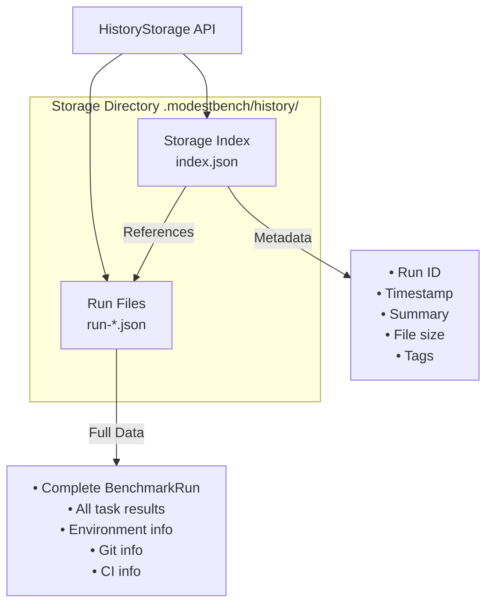

### 7.3 Data Structures

#### Storage Index (lines 28-46 in `src/storage/history.ts`)

```typescript
interface StorageIndex {
  readonly version: string; // Index schema version
  readonly created: Date; // Index creation timestamp
  readonly lastModified: Date; // Last update timestamp
  readonly entries: IndexEntry[]; // All run entries
}

interface IndexEntry {
  readonly id: string; // Unique run ID
  readonly filename: string; // run-YYYY-MM-DD-HASH.json
  readonly date: Date; // Run timestamp
  readonly sizeBytes: number; // File size
  readonly summary: string; // "10 files, 50 tasks"
  readonly tags: string[]; // User tags
}
```

#### Run File Structure

Each run is stored as a complete JSON serialization of `BenchmarkRun` (`src/types/core.ts` lines 12-37):

```json
{
  "ci": {
    "provider": "GitHub Actions"
    /* ... */
  },
  "config": {
    /* ... */
  },
  "duration": 150000,
  "endTime": "2025-10-18T12:02:30.000Z",
  "environment": {
    "nodeVersion": "v18.0.0",
    "platform": "darwin",
    "arch": "arm64",
    "cpu": {
      /* ... */
    },
    "memory": {
      /* ... */
    }
  },
  "files": [
    /* all file results */
  ],
  "git": {
    "commit": "abc123",
    "branch": "main"
    /* ... */
  },
  "id": "run-1729257600000-abc123def",
  "startTime": "2025-10-18T12:00:00.000Z",
  "summary": {
    "totalFiles": 10,
    "totalSuites": 25,
    "totalTasks": 150,
    "passedTasks": 148,
    "failedTasks": 2
    /* ... */
  }
}
```

### 7.4 Key Operations

#### Save Run (lines 353-382 in `src/storage/history.ts`)

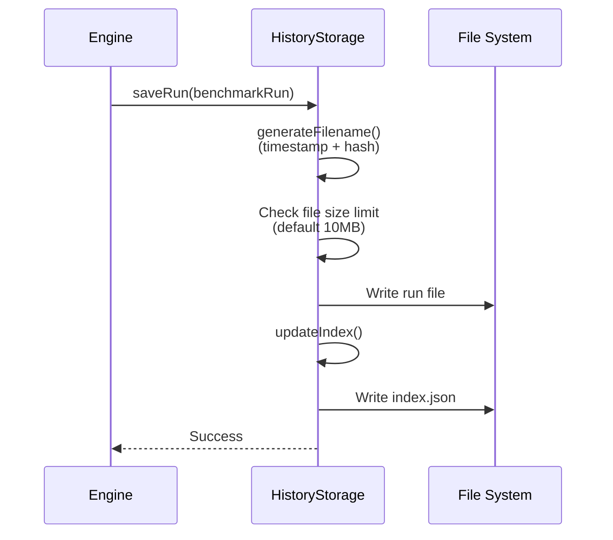

#### Query Runs (lines 283-348 in `src/storage/history.ts`)

Supports filtering by:

- **Date range**: `since`, `until`
- **Pattern matching**: Regex on summary
- **Tags**: Filter by benchmark tags
- **Sorting**: By date, name, duration
- **Pagination**: `offset`, `limit`

```typescript
const runs = await history.queryRuns({
  since: new Date('2025-10-01'),
  until: new Date('2025-10-18'),
  tags: ['performance', 'algorithm'],
  pattern: 'sorting',
  sortBy: 'date',
  sort: 'desc',
  limit: 10,
  offset: 0,
});
```

#### Cleanup (lines 77-153 in `src/storage/history.ts`)

Implements **retention policies** to manage storage:

```typescript
interface RetentionPolicy {
  maxAge?: number; // Max age in milliseconds
  maxRuns?: number; // Max number of runs to keep
  maxSize?: number; // Max total storage in bytes
}
```

**Cleanup Algorithm**:

1. Load index
2. Sort entries by date (oldest first)
3. For each entry, check if it violates any policy:
   - Age > maxAge
   - Total runs > maxRuns
   - Total size > maxSize
4. Remove violating files and update index

#### Export (lines 158-174 in `src/storage/history.ts`)

Supports:

- **JSON**: Pretty-printed benchmark runs
- **CSV**: Tabular format for spreadsheets

CSV fields (lines 397-430):

```csv
runId, startTime, endTime, duration, files, suites, tasks,
passed, failed, nodeVersion, platform, arch, gitCommit, gitBranch
```

### 7.5 Storage Location

**Default**: `.modestbench/history/` in current working directory

**Configurable**: Pass `storageDir` option to `FileHistoryStorage` constructor

```typescript
new FileHistoryStorage({
  storageDir: '/path/to/custom/history',
  maxFileSize: 10 * 1024 * 1024, // 10MB
});
```

### 7.6 Index Caching

The index is **cached in memory** after first load (line 52 in `src/storage/history.ts`):

```typescript
private index: null | StorageIndex = null;
```

**Invalidation**: Index is rewritten on every `saveRun()` and `cleanup()` operation.

**Performance**: This is efficient for CLI usage (short-lived processes) but could cause issues for long-running programmatic use if multiple processes write simultaneously.

---

## 8. Rarely-Used Features: Removal Candidates

### 8.1 Init Command Templates

**Command**: `modestbench init [type]`  
**Location**: `src/cli/commands/init.ts`

#### Opinion: ⚠️ SIMPLIFY

**Current Features**:

- Project type templates: `basic`, `advanced`, `library`
- Config file generation: JSON, YAML, JS, TS
- Example benchmark files

**Issues**:

1. **Inconsistent support**: Only JSON configs are loadable; YAML/JS/TS are templates only
2. **Maintenance overhead**: Each template needs updates when config schema changes
3. **Limited differentiation**: "basic" vs "advanced" vs "library" types aren't significantly different

**Recommendation**:

- Keep single `init` command with JSON config only
- Remove template variations
- Focus on one high-quality example

---

### 8.2 Git Information Collection

**Location**: `src/core/engine.ts` (lines 896-900)

#### Opinion: ⚠️ INCOMPLETE IMPLEMENTATION

**Current Status**:

```typescript
private async getGitInfo(): Promise<GitInfo | undefined> {
  // TODO: Implement Git information extraction
  // This would use child_process to run git commands
  return undefined;
}
```

**The `GitInfo` type is defined** (`src/types/core.ts` lines 182-200) but never populated.

**Options**:

1. **Implement**: Use `simple-git` package or `child_process`
2. **Remove**: Delete `GitInfo` type and references if not critical

**Recommendation**: Either implement fully or remove the placeholder. Git info is useful for CI tracking but not critical for local benchmarking.

---

### 8.3 History Compare Command

**Command**: `modestbench history compare <run-id1> <run-id2>`  
**Location**: `src/cli/commands/history.ts`

#### Opinion: 🤔 VERIFY IMPLEMENTATION

**Status**: Command is registered but actual comparison logic implementation unclear.

**Recommendation**: If not implemented, remove from CLI until implemented. If implemented, document thoroughly as it's a key differentiator.

---

## 9. Stateful Systems

### 9.1 State Inventory

| Subsystem            | Statefulness | Lifecycle  | Persistence      |
| -------------------- | ------------ | ---------- | ---------------- |
| **ErrorManager**     | ✅ Yes       | Per run    | None (in-memory) |
| **ProgressManager**  | ✅ Yes       | Per run    | None (in-memory) |
| **HistoryStorage**   | ✅ Yes       | Persistent | File system      |
| **ReporterRegistry** | ✅ Yes       | Process    | None (in-memory) |
| **HumanReporter**    | ✅ Yes       | Per run    | None (in-memory) |
| **ConfigManager**    | ❌ No        | Stateless  | N/A              |
| **BenchmarkEngine**  | ❌ No        | Stateless  | N/A              |
| **FileLoader**       | ❌ No        | Stateless  | N/A              |

### 9.2 ErrorManager State

**Location**: `src/core/error-manager.ts`

**State Stored**:

- `errors: ExecutionError[]` - Array of all handled errors (line 81)
- `handlers: ErrorHandler[]` - Registered error callbacks (line 83)
- `maxRecentErrors = 50` - Memory limit (line 85)

**Lifecycle**:

- Created per CLI invocation
- Accumulates errors during benchmark run
- Automatically trims to last 50 errors (lines 300-302)

**Memory Safety**: ✅ Bounded by `maxRecentErrors`

### 9.3 ProgressManager State

**Location**: `src/progress/manager.ts`

**State Stored**:

- `state: ProgressState` - Current progress (line 41)
- `callbacks: ProgressCallback[]` - Registered listeners (line 33)
- `metrics: ProgressMetrics | null` - Throughput calculations (line 39)
- `lastUpdate: number` - Throttling timestamp (line 35)

**Throttling**: Updates limited to every 100ms (line 43)

**Lifecycle**:

- `initialize(run)` - Set totals (lines 208-243)
- `update(changes)` - Incremental updates (lines 298-322)
- `cleanup()` - Reset state (lines 52-56)

**Memory Safety**: ✅ Bounded state, cleared after run

### 9.4 HistoryStorage State

**Location**: `src/storage/history.ts`

**In-Memory State**:

- `index: StorageIndex | null` - Cached index (line 52)

**Persistent State**:

- `.modestbench/history/index.json` - Run metadata
- `.modestbench/history/run-*.json` - Full benchmark results

**Concurrency**: ⚠️ **Not thread-safe**  
Multiple processes writing simultaneously could corrupt index.

**Size Limits**:

- Default max file size: 10MB
- Automatic cleanup via retention policies

### 9.5 HumanReporter State

**Location**: `src/reporters/human.ts`

**State Stored**:

- `startTime` - Run start timestamp (line 52)
- `lastProgressLine` - For terminal clearing (line 44)
- `progressTimer` - Spinner animation interval (line 46)
- `spinnerIndex` - Animation frame counter (line 50)

**Lifecycle**:

- `onStart()` - Initialize (lines 200-244)
- `onProgress()` - Update display (lines 166-198)
- `onEnd()` - Finalize (lines 78-123)

**Memory Safety**: ✅ Minimal state, timer cleaned up

---

## 10. Environment Variable Behaviors

### 10.1 Environment Variables Used

| Variable           | Purpose                     | Location                 | Default         | Impact                     |
| ------------------ | --------------------------- | ------------------------ | --------------- | -------------------------- |
| `DEBUG`            | Show stack traces on errors | `src/cli/index.ts`       | `undefined`     | Error verbosity            |
| `CI`               | Detect CI environment       | `src/core/engine.ts`     | `'false'`       | Enable CI info collection  |
| `NODE_ENV`         | Environment mode            | `src/core/engine.ts`     | `'development'` | Stored in environment info |
| `FORCE_COLOR`      | Force color output          | `src/reporters/human.ts` | `undefined`     | Override color detection   |
| `NO_COLOR`         | Disable color output        | `src/reporters/human.ts` | `undefined`     | Override color detection   |
| **GitHub Actions** | CI provider detection       | `src/core/engine.ts`     | N/A             | See below                  |

### 10.2 DEBUG Mode

**Usage**: `DEBUG=1 modestbench run`

**Behavior**:

- Shows full error stack traces (lines 477-479 in `src/cli/index.ts`)
- Prints error details on uncaught exceptions (lines 494-496)

```typescript
if (process.env.DEBUG) {
  console.error(err.stack);
}
```

### 10.3 CI Detection

**Primary Detection**: `src/core/engine.ts` (lines 724-759)

```typescript
if (!process.env.CI) {
  return undefined; // Not in CI
}
```

**GitHub Actions Detection**:

When `GITHUB_ACTIONS` is set, captures:

| GitHub Variable     | ModestBench Field        | Purpose            |
| ------------------- | ------------------------ | ------------------ |
| `GITHUB_RUN_NUMBER` | `buildNumber`            | Job number         |
| `GITHUB_REPOSITORY` | Used to build `buildUrl` | e.g., `owner/repo` |
| `GITHUB_RUN_ID`     | Used to build `buildUrl` | Job run ID         |
| `GITHUB_REF_NAME`   | `branch`                 | Branch or PR ref   |
| `GITHUB_EVENT_NAME` | Determines `pullRequest` | Event type         |
| `GITHUB_SHA`        | `commit`                 | Commit SHA         |

**Other CI Providers**:

Falls back to generic detection:

- `BRANCH` → `branch`
- `COMMIT` → `commit`
- Provider shown as "Unknown CI"

**Output in Results**:

```json
{
  "ci": {
    "provider": "GitHub Actions",
    "buildNumber": "42",
    "buildUrl": "https://github.com/owner/repo/actions/runs/123456",
    "branch": "main",
    "commit": "abc123",
    "pullRequest": "refs/pull/42/merge"
  }
}
```

### 10.4 Color Output Control

**Location**: `src/reporters/human.ts` (lines 68-72)

**Detection Logic**:

```typescript
this.useColor =
  options.color ??
  (process.stdout.isTTY &&
    process.env.FORCE_COLOR !== '0' &&
    process.env.NO_COLOR == null);
```

**Priority**:

1. Explicit `--color` / `--no-color` CLI flag
2. `NO_COLOR` environment variable (disables color)
3. `FORCE_COLOR` environment variable (enables color unless `'0'`)
4. TTY detection

**Examples**:

```bash
# Force color in CI
FORCE_COLOR=1 modestbench run

# Disable color
NO_COLOR=1 modestbench run
```

### 10.5 NODE_ENV

**Usage**: Stored in environment info but **does not change behavior**

```typescript
env: {
  CI: process.env.CI || 'false',
  NODE_ENV: process.env.NODE_ENV || 'development',
}
```

This is captured for historical tracking but doesn't affect benchmark execution.

---

## 11. Architecture Diagrams

### 11.1 Complete System Data Flow

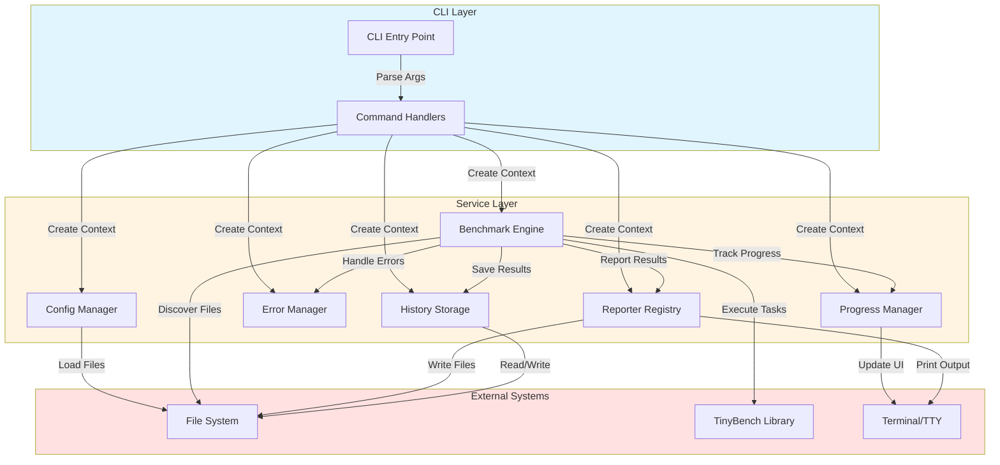

### 11.2 Reporter Lifecycle

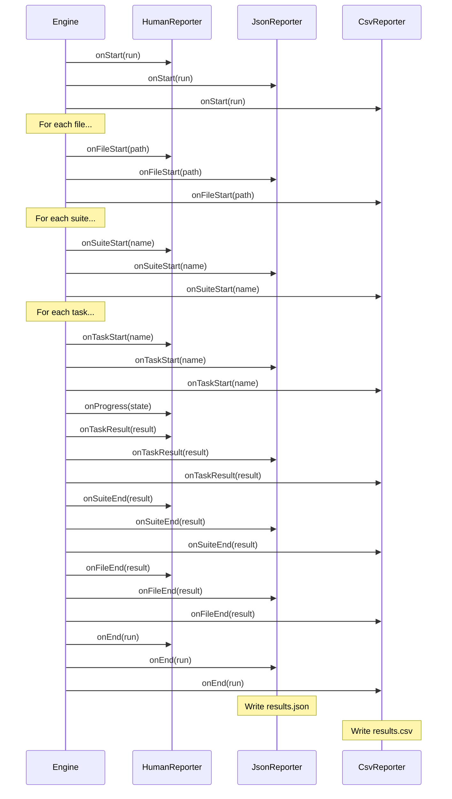

---

## 12. Key Architectural Decisions

### 12.1 Engine Abstraction Pattern

**Why**: Support multiple benchmark execution strategies without code duplication  
**How**: Abstract base class with single `executeBenchmarkTask()` hook  
**Trade-off**: Easier to add new engines, but requires understanding the abstraction

### 12.2 Dependency Injection

**Why**: Enables testing and flexibility  
**How**: Services passed to `ModestBenchEngine` constructor  
**Trade-off**: More verbose setup for programmatic use

### 12.3 Synchronous File I/O in HistoryStorage

**Why**: Simplicity  
**Where**: Uses `fs.readFileSync`, `fs.writeFileSync`  
**Trade-off**: Could block in high-frequency scenarios  
**Mitigation**: CLI usage is typically one-shot

### 12.4 TinyBench Wrapper (Not Fork)

**Why**: Leverage maintained library, avoid duplication  
**How**: Thin wrapper in `TinybenchEngine.executeBenchmarkTask()`  
**Trade-off**: Dependent on TinyBench API stability  
**Alternative**: AccurateEngine provides custom implementation option

### 12.5 Shared Statistical Processing

**Why**: Consistent result quality across engines  
**How**: Both engines use same IQR filtering and statistics calculation  
**Trade-off**: Requires standardizing on nanosecond-precision samples

### 12.6 File-Based History Storage

**Why**: Simple, portable, no database dependencies  
**Where**: JSON files in `.modestbench/history/`  
**Trade-off**: No multi-process safety, query performance limited  
**Alternative considered**: SQLite

---

## 13. Performance Characteristics

### 13.1 File Discovery

**Implementation**: Uses `glob` package  
**Performance**: O(n) where n = number of files scanned  
**Typical**: <100ms for 1000 files

### 13.2 Progress Updates

**Throttling**: 100ms minimum between updates  
**Impact**: Reduces terminal I/O overhead  
**UI responsiveness**: Acceptable for human perception

### 13.3 History Queries

**Index loading**: O(1) with in-memory cache  
**Filtering**: O(n) linear scan of entries  
**Run loading**: O(m) where m = matching runs  
**Optimization**: Index filters before loading full run files

### 13.4 Benchmark Execution

**TinybenchEngine Overhead**: Minimal wrapper around TinyBench  
**AccurateEngine Overhead**: Custom measurement loop with V8 guards  
**Progress updates**: Every 500ms (TinybenchEngine) or every 100 samples (AccurateEngine)  
**Reporter callbacks**: Synchronous execution could add overhead if reporters are slow

---

## 14. Security Considerations

### 14.1 Dynamic Imports

**Risk**: Benchmark files are dynamically imported  
**Mitigation**: Limited to files matching glob patterns  
**Recommendation**: Run benchmarks in isolated environments if executing untrusted code

### 14.2 File System Access

**History storage**: Writes to `.modestbench/history/`  
**Reporter output**: Writes to configured `outputDir`  
**Risk**: Path traversal if user controls paths  
**Current mitigation**: Paths resolved relative to CWD

### 14.3 Configuration Loading

**Risk**: JS/TS config files execute arbitrary code via dynamic imports  
**Mitigation**: Config files are treated as trusted code (like package.json scripts)  
**Implementation**: Uses cosmiconfig with dynamic `import()` for TypeScript files

### 14.4 V8 Native Syntax

**Risk**: AccurateEngine uses `new Function()` with V8 intrinsics  
**Mitigation**: String is hardcoded, never influenced by user input  
**Alternative**: Falls back to basic mode without `--allow-natives-syntax`

---

## 15. Testing Strategy

### 15.1 Test Organization

**Location**: `/test/`

**Structure**:

- `unit/` - Pure function tests
- `integration/` - Component interaction tests
- `contract/` - Interface compliance tests

### 15.2 Key Test Files

| Test File                                     | Coverage                       |
| --------------------------------------------- | ------------------------------ |
| `test/contract/tinybench-engine.test.ts`      | TinybenchEngine implementation |
| `test/contract/accurate-engine.test.ts`       | AccurateEngine implementation  |
| `test/integration/engine-comparison.test.ts`  | Engine compatibility           |
| `test/integration/test_reporters.test.ts`     | Reporter output                |
| `test/integration/test_configuration.test.ts` | Config loading                 |

### 15.3 Engine Contract Testing

Both concrete engines (`TinybenchEngine` and `AccurateEngine`) are tested against the same contract to ensure API compatibility. This guarantees they can be swapped without breaking user code.

### 15.4 Test Utilities

**Location**: `test/util.ts`  
Provides test helpers and fixtures

---

## 16. Source Code Reference Map

| Subsystem     | Primary File                           | Lines of Code | Key Classes/Functions                          |
| ------------- | -------------------------------------- | ------------- | ---------------------------------------------- |
| CLI Entry     | `src/cli/index.ts`                     | 650           | `cli()`, `main()`, `createCliContext()`        |
| Run Command   | `src/cli/commands/run.ts`              | 305           | `handleRunCommand()`                           |
| Engine Base   | `src/core/engine.ts`                   | 891           | `ModestBenchEngine` (abstract)                 |
| Tinybench     | `src/core/engines/tinybench-engine.ts` | 336           | `TinybenchEngine`                              |
| Accurate      | `src/core/engines/accurate-engine.ts`  | 408           | `AccurateEngine`                               |
| Stats         | `src/core/stats-utils.ts`              | ~150          | `calculateStatistics`, `removeOutliersIQR`     |
| Loader        | `src/core/loader.ts`                   | 416           | `BenchmarkFileLoader`                          |
| Error Manager | `src/core/error-manager.ts`            | 373           | `ModestBenchErrorManager`                      |
| Config        | `src/config/manager.ts`                | 465           | `ModestBenchConfigurationManager`              |
| History       | `src/storage/history.ts`               | 605           | `FileHistoryStorage`                           |
| Progress      | `src/progress/manager.ts`              | 413           | `ModestBenchProgressManager`                   |
| Reporters     | `src/reporters/`                       | ~800          | `HumanReporter`, `JsonReporter`, `CsvReporter` |
| Types         | `src/types/`                           | ~600          | Interface definitions                          |

**Total Source Code**: ~6,500 lines

---

## 17. Recommendations Summary

### High Priority

1. **✅ Replace configuration loading with cosmiconfig** - Enables YAML/JS/TS support, reduces code
2. **✅ Create public API entry point** - Document programmatic usage
3. **⚠️ Complete or remove Git info collection** - Half-implemented feature
4. **⚠️ Add concurrency control to HistoryStorage** - Prevent index corruption

### Medium Priority

1. **🤔 Remove syntax validation** - Redundant, error-prone
2. **🤔 Simplify init command** - Remove unused template variations

### Low Priority

1. Document environment variables in README
2. Add programmatic API examples
3. Consider SQLite for history storage (performance + safety)

---

## 18. Glossary

| Term                | Definition                                                            |
| ------------------- | --------------------------------------------------------------------- |
| **Benchmark Run**   | Complete execution of all discovered benchmark files                  |
| **Suite**           | Collection of related benchmark tasks                                 |
| **Task**            | Single benchmark operation (one function to measure)                  |
| **Reporter**        | Output formatter (human, JSON, CSV)                                   |
| **History Storage** | Persistent benchmark result storage                                   |
| **Progress State**  | Real-time execution progress tracking                                 |
| **Execution Phase** | Stage of benchmark execution (discovery, validation, execution, etc.) |
| **TinyBench**       | External benchmark library wrapped by TinybenchEngine                 |
| **AccurateEngine**  | Custom benchmark engine with V8 optimization guards                   |
| **TinybenchEngine** | Engine that wraps the tinybench library                               |
| **IQR Filtering**   | Interquartile Range outlier removal for sample cleanup                |
| **V8 Intrinsics**   | Low-level V8 functions for optimization control                       |
| **CliContext**      | Dependency injection container for CLI commands                       |

---

This architectural overview provides a comprehensive understanding of ModestBench's internal structure, design decisions, and areas for improvement. The system is well-architected with clear separation of concerns through the engine abstraction pattern, enabling both tinybench integration and custom measurement approaches.
