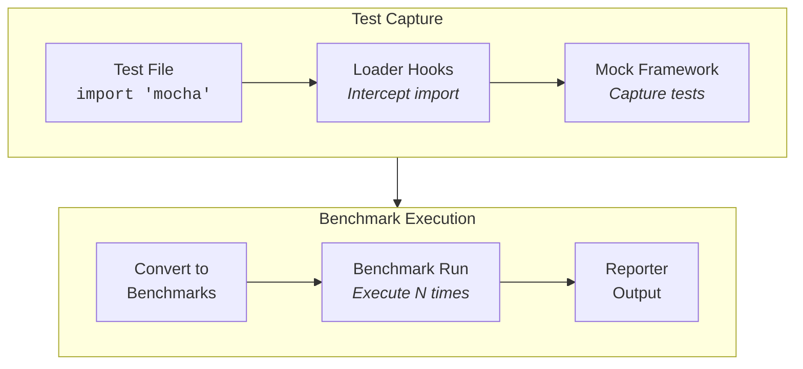

Already have a test suite? **modestbench** can run your existing test files as benchmarks without any code changes. This is useful for quick performance checks, finding slow tests, and adding performance metrics to your CI pipeline.

## Quick Start

```bash
# Run Jest tests as benchmarks
modestbench test jest "test/*.test.js"

# Run Mocha tests as benchmarks
modestbench test mocha "test/*.spec.js"

# Run node:test files as benchmarks
modestbench test node-test "test/*.test.js"

# Run AVA tests as benchmarks
modestbench test ava "test/*.js"
```

That's it. Each test becomes a benchmark task, and you get timing statistics for every test in your suite.

## Supported Frameworks

### Jest

Works with standard Jest test files using `describe`/`it`/`test` syntax:

```javascript
// test/example.test.js
import { parseConfig } from '../src/config.js';

describe('Config Parser', () => {
  beforeEach(() => {
    // Runs before each iteration
  });

  it('parses JSON config', () => {
    const result = parseConfig('{"key": "value"}');
    expect(result).toEqual({ key: 'value' });
  });

  test('handles empty config', () => {
    const result = parseConfig('{}');
    expect(result).toEqual({});
  });
});
```

```bash
modestbench test jest "test/*.test.js"
```

### Mocha

Works with standard Mocha test files using `describe`/`it` syntax:

```javascript
// test/example.spec.js
import { expect } from 'chai';
import { parseConfig } from '../src/config.js';

describe('Config Parser', () => {
  beforeEach(() => {
    // Runs before each iteration
  });

  it('parses JSON config', () => {
    const result = parseConfig('{"key": "value"}');
    expect(result).to.deep.equal({ key: 'value' });
  });

  it('handles empty config', () => {
    const result = parseConfig('{}');
    expect(result).to.deep.equal({});
  });
});
```

```bash
modestbench test mocha "test/*.spec.js"
```

### node:test

Works with Node.js built-in test runner (`node:test` module):

```javascript
// test/example.test.js
import { test, describe, beforeEach } from 'node:test';
import assert from 'node:assert';
import { parseConfig } from '../src/config.js';

describe('Config Parser', () => {
  beforeEach(() => {
    // Runs before each iteration
  });

  test('parses JSON config', () => {
    const result = parseConfig('{"key": "value"}');
    assert.deepStrictEqual(result, { key: 'value' });
  });

  test('handles empty config', () => {
    const result = parseConfig('{}');
    assert.deepStrictEqual(result, {});
  });
});
```

```bash
modestbench test node-test "test/*.test.js"
```

### AVA

Works with AVA test files:

```javascript
// test/example.js
import test from 'ava';
import { parseConfig } from '../src/config.js';

test.beforeEach(() => {
  // Runs before each iteration
});

test('parses JSON config', t => {
  const result = parseConfig('{"key": "value"}');
  t.deepEqual(result, { key: 'value' });
});

test('handles empty config', t => {
  const result = parseConfig('{}');
  t.deepEqual(result, {});
});
```

```bash
modestbench test ava "test/*.js"
```

## How It Works

The `test` command uses ES module loader hooks to intercept imports of your test framework. When your test file imports `jest`, `mocha`, `ava`, or `node:test`, modestbench provides a mock implementation that captures test definitions instead of running them.



### Test → Benchmark Mapping

| Test Concept | Benchmark Concept |
|--------------|-------------------|
| `describe` block | Suite |
| `it`/`test` block | Task |
| `beforeEach` | Runs before each iteration |
| `afterEach` | Runs after each iteration |
| `before`/`beforeAll` | Suite setup |
| `after`/`afterAll` | Suite teardown |

## Options

### `--iterations`, `-i`

Number of times to run each test (default: 100).

```bash
# Fewer iterations for slow tests
modestbench test mocha "test/*.spec.js" --iterations 50

# More iterations for fast tests
modestbench test mocha "test/*.spec.js" --iterations 500
```

### `--warmup`, `-w`

Number of warmup iterations before measurement begins (default: 5).

```bash
modestbench test mocha "test/*.spec.js" --warmup 10
```

### `--bail`, `-b`

Stop on first failure.

```bash
modestbench test mocha "test/*.spec.js" --bail
```

### `--json`

Output results in JSON format, suitable for CI integration.

```bash
modestbench test mocha "test/*.spec.js" --json > results.json
```

### `--quiet`, `-q`

Minimal output mode.

```bash
modestbench test mocha "test/*.spec.js" --quiet
```

## Use Cases

### Finding Slow Tests

Run your test suite as benchmarks to identify tests that take longer than expected:

```bash
modestbench test mocha "test/**/*.spec.js" --iterations 10
```

Look for tests with high mean times or low ops/second.

### Performance Regression Detection

Add benchmark runs to your CI pipeline:

```yaml
# .github/workflows/perf.yml
name: Performance Tests
on: [push, pull_request]

jobs:
  benchmark:
    runs-on: ubuntu-latest
    steps:
      - uses: actions/checkout@v4
      - uses: actions/setup-node@v4
        with:
          node-version: 20

      - run: npm ci

      - name: Run test benchmarks
        run: |
          npx modestbench test mocha "test/**/*.spec.js" \
            --iterations 50 \
            --json > benchmark-results.json

      - name: Upload results
        uses: actions/upload-artifact@v4
        with:
          name: benchmark-results
          path: benchmark-results.json
```

### Quick Sanity Checks

Before committing, quickly check if your changes made tests significantly slower:

```bash
modestbench test node-test "test/unit/*.test.js" --iterations 10 --quiet
```

## Limitations

- **Assertions still run**: Tests execute fully including assertions. If a test fails, it's counted as a benchmark failure.
- **External dependencies**: Tests that depend on external services (databases, APIs) will include network latency in timings.
- **Test isolation**: Each iteration runs the same test function. If your test modifies shared state, results may vary.
- **Async tests**: Async tests are supported but timing includes all `await` operations.

## Tips

### Isolate What You're Measuring

If you want to benchmark just the code under test (not setup/assertions), consider creating dedicated benchmark files:

```javascript
// benchmarks/config-parser.bench.js
export default {
  'parseConfig - JSON': () => {
    parseConfig('{"key": "value"}');
  },
  'parseConfig - empty': () => {
    parseConfig('{}');
  },
};
```

### Use Fewer Iterations for Slow Tests

Integration tests with database calls or network requests should use fewer iterations:

```bash
modestbench test mocha "test/integration/*.spec.js" --iterations 10
```

### Combine with Regular Benchmarks

Use the test adapter for quick checks, then write dedicated benchmarks for critical paths:

```bash
# Quick overview of all tests
modestbench test mocha "test/**/*.spec.js" --iterations 10

# Detailed benchmarks for critical code
modestbench run "benchmarks/**/*.bench.js" --iterations 1000
```

## Next Steps

- Learn about [CLI options](/guides/cli/#modestbench-test) for the test command
- Explore [Output Formats](/guides/output/) for reporter options
- Set up [Performance Budgets](/guides/performance-budgets/) to enforce standards

